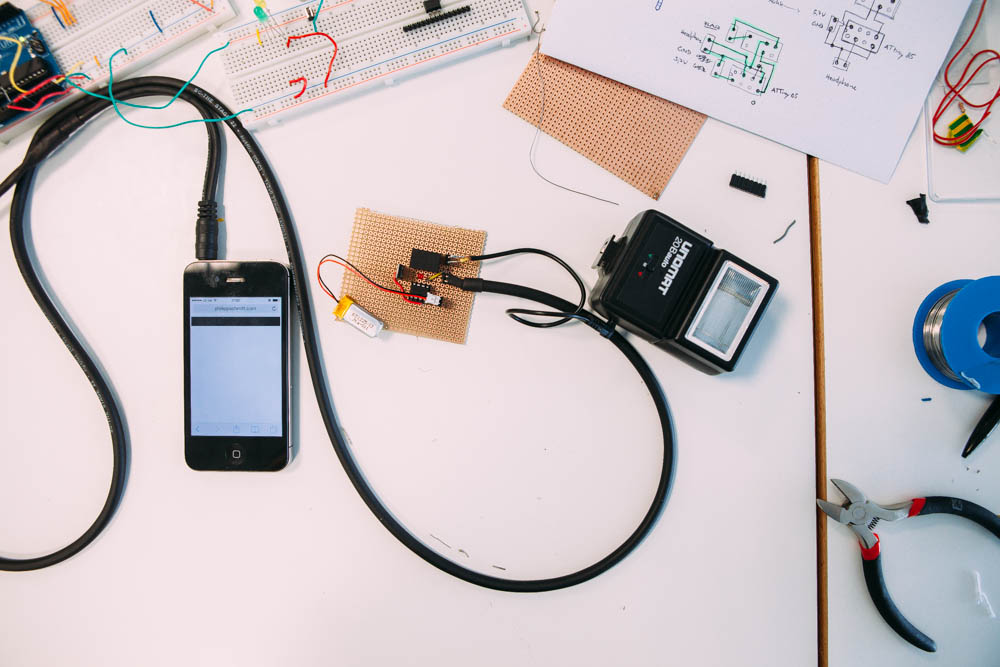
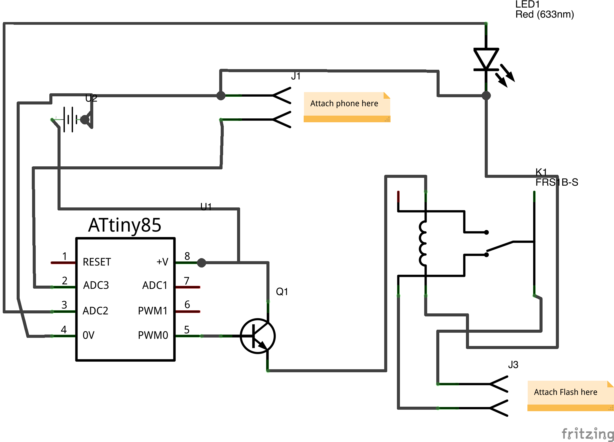

# Headphone to Arduino

This setup allows you to trigger a camera flash from your phones' headphone jack with a short sound impulse.

I used it for this: http://philippschmitt.com/projects/lightpainting

## Setup

Using Javascript and the Web Audio API, 50ms long sound impulses are sent from a webpage running on the phone.
An ATtiny85 microprocessor is listening for audio input (voltage changes) from a phone headphone jack connected via a simple audio cable.
When the microprocessor is connected, it connects the two wires of a flash synchron cable and thereby triggers the flash.

The flash needs some seconds to reload after it has been triggered. Impulses arriving in the meantime are added to a flash queue, where they wait until the flash has reloaded. The LED is on as long as there are impulses waiting in the queue.

Setup and programming an ATtiny85 is easy. Here's a nice tutorial: http://www.creativeapplications.net/tutorials/small-programmable-wearable-and-cheap-enjoying-the-attiny85-tutorial/

## Parts needed
- Camera Flash with synchron cable (I'm using an Unomat 20B auto)
- ATtiny85 microprocessor, Arduino or similar
- Power supply, e.g. LIPO 3.7V 110mAh battery
- Transistor, e.g. BD 137-16
- Relay, e.g. FRS1B-S
- audio cable that fits your phone's audio output

## Circuit Design
Since flash circuits usually carry high voltages (180V in my case), the circuit has to be isolated from your microprocessor and headphone jack. This is accomplished by using a relay.
Because the current from the ATtiny output pin is too weak to drive the relay, I'm using a transistor.

Here's the circuit and a breadboard example:

Author: Philipp Schmitt  
Contact: mail@philippschmitt.com
